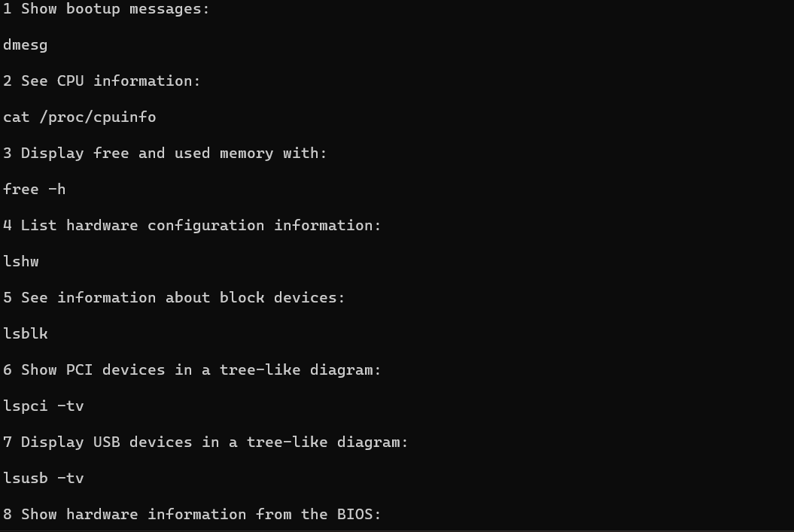

# linux-commands-webscrapper
This is a basic webscrapper that scrapes task and corresponding commands from site : https://phoenixnap.com/kb/linux-commands-cheat-sheet

# Bried intro of webscrapper
Basically, webscrapper is a software that imports data from a website and can store that as .xls file
Webscrapper can make whole internet as our database which can be displayed as we want or can be stored in many formats.

Here i webscrapped : https://phoenixnap.com/kb/linux-commands-cheat-sheet and displayed (# 126) different commands of linux terminal using python (BeautifulSoup library) in this format :

# commandNumber taskThatCanBePerformed
# (and command in next line) Command

Because it's a basic webscrapper, i displayed scraped info in terminal as :

Img1 :

Img2 :

Img3 :

Img4 :

